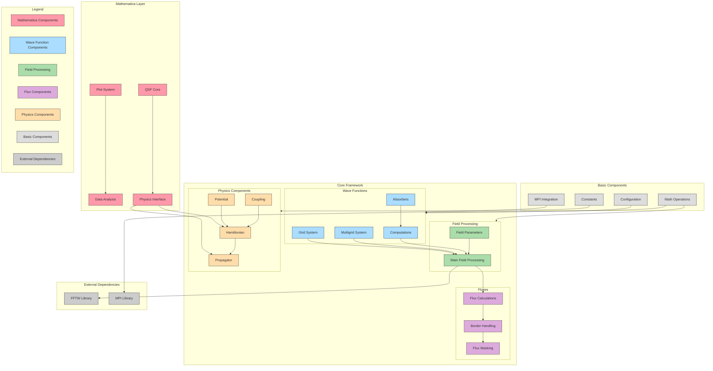

# Diagram

```mermaid
graph TB
    subgraph ML["Mathematica Layer"]
        QSF["QSF Core"]:::mathematica
        PG["Plot System"]:::mathematica
        DA["Data Analysis"]:::mathematica
        PI["Physics Interface"]:::mathematica
    end

    subgraph CF["Core Framework"]
        subgraph WF["Wave Functions"]
            GS["Grid System"]:::wf
            MGS["Multigrid System"]:::wf
            ABS["Absorbers"]:::wf
            COMP["Computations"]:::wf
        end

        subgraph FP["Field Processing"]
            FPM["Main Field Processing"]:::field
            FPP["Field Parameters"]:::field
        end

        subgraph FX["Fluxes"]
            FC["Flux Calculations"]:::flux
            BH["Border Handling"]:::flux
            FM["Flux Masking"]:::flux
        end

        subgraph PC["Physics Components"]
            HAM["Hamiltonian"]:::physics
            PROP["Propagator"]:::physics
            POT["Potential"]:::physics
            COUP["Coupling"]:::physics
        end
    end

    subgraph BC["Basic Components"]
        CONF["Configuration"]:::basic
        CONST["Constants"]:::basic
        MATH["Math Operations"]:::basic
        MPI["MPI Integration"]:::basic
    end

    subgraph EX["External Dependencies"]
        FFTW["FFTW Library"]:::external
        MPIL["MPI Library"]:::external
    end

    %% Relationships
    QSF --> PI
    PI --> HAM
    PI --> PROP
    PG --> DA
    
    GS --> FPM
    MGS --> FPM
    ABS --> COMP
    COMP --> FPM
    
    FPM --> FC
    FPP --> FPM
    
    FC --> BH
    BH --> FM
    
    HAM --> PROP
    POT --> HAM
    COUP --> HAM
    
    CONF --> WF
    CONST --> PC
    MATH --> WF
    MATH --> FP
    MPI --> MPIL
    
    FPM --> FFTW

    %% Click Events
    click CONF "https://github.com/QSF-physics/QSF/blob/main/include/basics/config.h"
    click CONST "https://github.com/QSF-physics/QSF/blob/main/include/basics/constants.h"
    click MATH "https://github.com/QSF-physics/QSF/blob/main/include/basics/math_basic.h"
    click MPI "https://github.com/QSF-physics/QSF/blob/main/include/basics/mpi_logic.h"
    click GS "https://github.com/QSF-physics/QSF/blob/main/include/wf/grid.h"
    click MGS "https://github.com/QSF-physics/QSF/tree/main/include/wf/multigrid"
    click ABS "https://github.com/QSF-physics/QSF/blob/main/include/wf/absorbers.h"
    click COMP "https://github.com/QSF-physics/QSF/blob/main/include/wf/computations.h"
    click FPM "https://github.com/QSF-physics/QSF/blob/main/include/field.h"
    click FPP "https://github.com/QSF-physics/QSF/blob/main/include/field_p.h"
    click FC "https://github.com/QSF-physics/QSF/blob/main/include/fluxes/flux.h"
    click BH "https://github.com/QSF-physics/QSF/blob/main/include/fluxes/borders.h"
    click FM "https://github.com/QSF-physics/QSF/blob/main/include/fluxes/flux_mask.h"
    click HAM "https://github.com/QSF-physics/QSF/blob/main/include/hamiltonian.h"
    click PROP "https://github.com/QSF-physics/QSF/blob/main/include/propagator.h"
    click POT "https://github.com/QSF-physics/QSF/blob/main/include/potential.h"
    click COUP "https://github.com/QSF-physics/QSF/blob/main/include/coupling.h"
    click QSF "https://github.com/QSF-physics/QSF/blob/main/mathematica/QSF/Kernel/QSF.wl"
    click PG "https://github.com/QSF-physics/QSF/tree/main/mathematica/PlotGrid"
    click DA "https://github.com/QSF-physics/QSF/blob/main/mathematica/QSF/Kernel/DataAnalysis.wl"
    click PI "https://github.com/QSF-physics/QSF/blob/main/mathematica/QSF/Kernel/Physics.wl"
    click FFTW "https://github.com/QSF-physics/QSF/blob/main/cmake/FindFFTW.cmake"

    %% Styles
    classDef mathematica fill:#f9a,stroke:#333
    classDef wf fill:#adf,stroke:#333
    classDef field fill:#ada,stroke:#333
    classDef flux fill:#dad,stroke:#333
    classDef physics fill:#fda,stroke:#333
    classDef basic fill:#ddd,stroke:#333
    classDef external fill:#ccc,stroke:#333

    %% Legend
    subgraph Legend
        L1["Mathematica Components"]:::mathematica
        L2["Wave Function Components"]:::wf
        L3["Field Processing"]:::field
        L4["Flux Components"]:::flux
        L5["Physics Components"]:::physics
        L6["Basic Components"]:::basic
        L7["External Dependencies"]:::external
    end
```

## Testing

Define `TEST_MULTIGRID_MASK` C preprocessor flag to output region=1 grid/grid slice masks.
